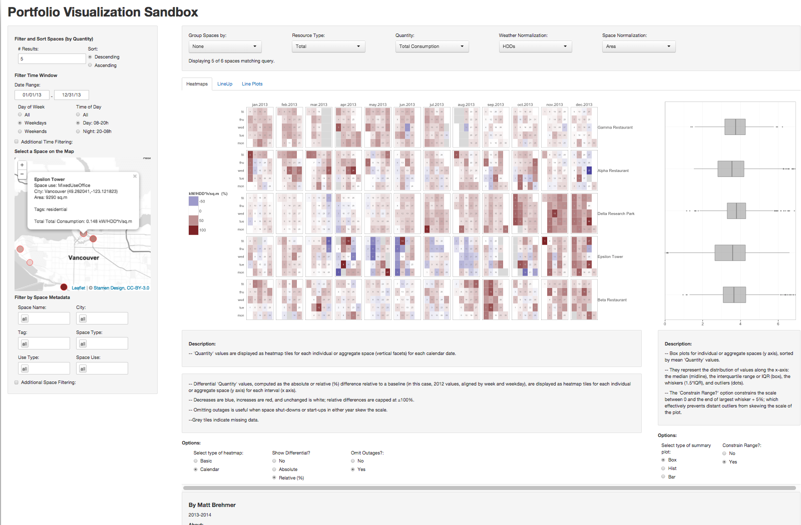
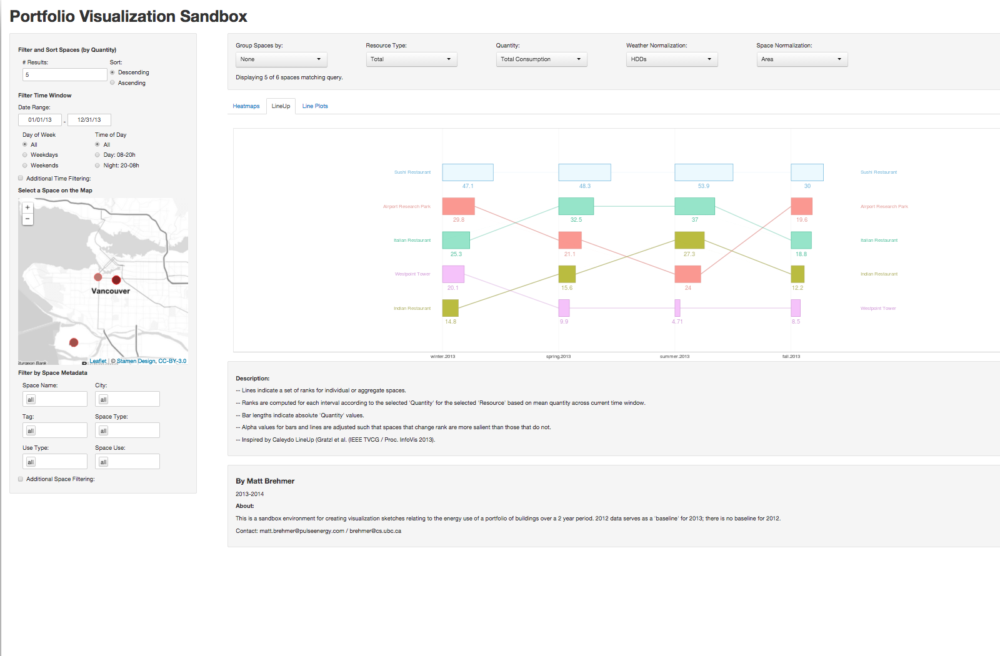
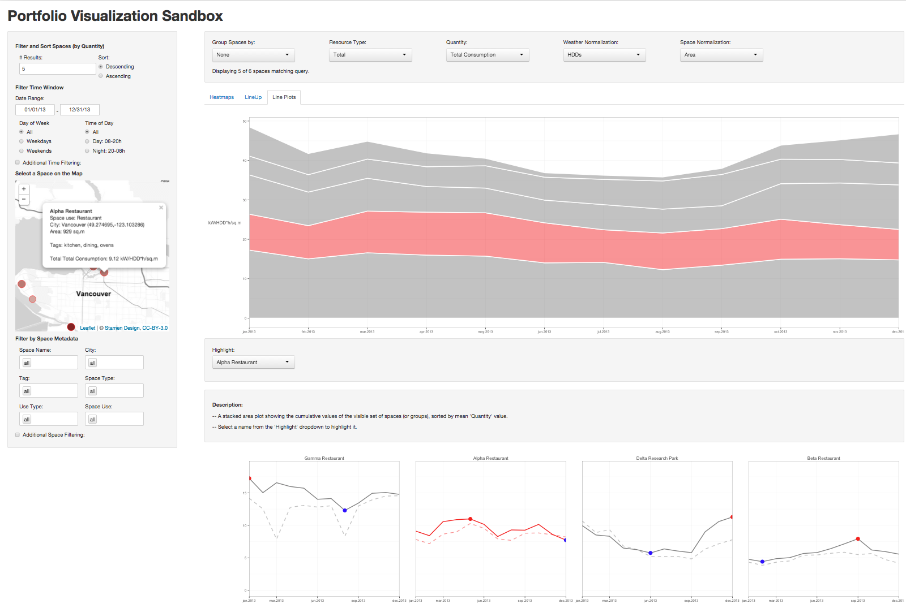

Portfolio Visualization Sandbox
========

This project contains code for a [R/Shiny](http://www.rstudio.com/shiny/) application that produces several types of visualizations of energy use for portfolios of spaces over time. These portfolios are typically those of multi-space organizations such as universities, health care networks, or school boards. 

An [instance of the portfolio visualization sandbox](https://mattbrehmer.shinyapps.io/PortfolioSandbox/) is running on [shinyapps.io](http://www.shinyapps.io/). Username: ieeevis / password: vis2015.

These visualizations include [ggplot2](http://ggplot2.org/) implementations of faceted time-series line plots, stacked area charts, (calendar) heatmaps, bar charts, box plots, histogram/density plots, and a ranking visualization inspired by [Caleydo's LineUp](http://lineup.caleydo.org). The application also includes a map-based visualization using [jcheng5's leaflet-shiny](https://github.com/jcheng5/leaflet-shiny) package.

There are 3 main views on portfolio data, each having a dedicated tab in the interface: (1) seasonal, monthly, or calendar heatmaps with aligned summary charts (boxplots, histogram/density plots, and bar charts), used for analysis at a coarse time granularity; (2) a "LineUp" ranking visualization, used for comparing a small number of itmes at coarse time granularities; (3) a stacked area with accompanying individual faceted line plots for fine-scale time-series load profile analysis.

Visualizations are drawn using [reactive functions](http://rstudio.github.io/shiny/tutorial/#reactivity) bound to global controls for selection, filtering, aggregation, and normalization. Time window filtering is accomplished with a date range selector, options to focus on daytime/nighttime and weekday/weekend, as well as with advanced options to filter by season or month. Space metadata filtering is accomplished using a conjunction of filters on space name, space use, use type, space type, tag, and city; advanced options are included to filter by space area, building age, occupant count, and operating hours. Spaces can be aggregated by shared space use, use type, space type, tag, and city. Their data can be normalized by space area, occupant count, and operating hours, as well as by weather (# HDDs and CDDs). 

## Portfolio Data

The application loads data from three sources:

* [portfolio-name]/[portfolio-name]-performance.csv

1\ Performance data for all spaces in a portfolio; currently, the application can understands the resource types and temporal granularities returned by the Pulse R API to fetch portfolio energy use performance data.

* [portfolio-name]/[portfolio-name]-metadata.csv

2\ Metadata for all spaces in a portfolio; currently, the application uses space name, city, space type, space use, use type, area, occupant count, weekly operating hours, year consructed / building age, latitude, and longitude

* [portfolio-name]/[portfolio-name]-tags.csv

3\ Categorical tags for some or all spaces in a portfolio: a space can have zero, one, or more categorical descriptor tags, for adding more information about a space not captured by existing metadata fields

### Example Data

An example portfolio is provided in the [sandbox/](https://github.com/mattbrehmer/PortfolioSandbox/tree/master/sandbox) folder. This contains space metadata, space tags, and energy use data for a small portfolio (6 spaces) over a time span of 2 years (Jan 2012 - Dec 2013) at a 4h granularity. Data for individual years is also provided. The performance data contains multiple resources (Electricity, Steam, Natural Gas), as well as measurements of Total, Total Baseload, and Electricity Baseload. 2012 Data is also used as a baseline for 2013 (paired data points are aligned to matching week numbers and weekdays).

The application has been used for university campus and school board portfolios with up to ~100 spaces. 

## Dependencies

Several packages are used, some of which require [devtools](http://www.rstudio.com/projects/devtools/) to install the package from github. These include the newest development versions of [shiny](https://github.com/rstudio/shiny) and [leaflet](https://github.com/jcheng5/leaflet-shiny). See [global.R](https://github.com/mattbrehmer/PortfolioSandbox/blob/master/global.R) for other packages required from CRAN. Recommended: ggplot2, data.table, plyr, foreach, reshape2, grid, maps, scales, rjson.

## Usage

Launch the Shiny application:

	> shiny::runApp()
	
Or launch it from the terminal:

	> R -e 'require(shiny); runApp(port=8100)' &.
	
This will process the data and open a new browser tab with debug statements output to the console. You may want to run this command as a separate process in a terminal such that it won't tie up your R/RStudio console environment.

## Organization

The Shiny application itself is comprised of several files: 

* The data is loaded from csv in [global.R](https://github.com/mattbrehmer/PortfolioSandbox/blob/master/global.R). This file also tidies and formats data tables containing space performance data, space metadata, and space tags.

* The user interface components (headers, divs, tabs, text content) is specified in [ui.R](https://github.com/mattbrehmer/PortfolioSandbox/blob/master/ui.R). 

* The reactive controls for [selecting](https://github.com/mattbrehmer/PortfolioSandbox/blob/master/server/selectOptions.R), [filtering](https://github.com/mattbrehmer/PortfolioSandbox/blob/master/server/filterOptions.R), [aggregating, and normalizing](https://github.com/mattbrehmer/PortfolioSandbox/blob/master/server/reactiveFunctions.R) portfolio data is specified in the [server](https://github.com/mattbrehmer/PortfolioSandbox/tree/master/server) directory, which are all sourced by [server.R](https://github.com/mattbrehmer/PortfolioSandbox/blob/master/server.R). Most of the visualization code lives here in individual server/plot---.R files.

* Some additional non-reactive utility functions are specified in [dataFunctions.R](https://github.com/mattbrehmer/PortfolioSandbox/blob/master/dataFunctions.R), including functions for filtering, ranking, and computing differentials.

## Known Issues

* Initial loading times can be on the order of a few minutes for large portfolios. Reactive functions can also take several seconds to complete before plots refresh. Be patient.

* Cryptic Shiny error/warning messages will appear in the console. The Shiny debugger may help clarify these (command-F3 in the browser opens the Shiny call graph visualization in a new tab).

* The latitude/longitude resolution for shape placement on [leaflet](https://github.com/jcheng5/leaflet-shiny) maps is far from perfect, and appears to be a problem with the code that ports [leaflet](http://leafletjs.com/) to R. Only 6 significant digits are used, including '-'; the effect of this for coordinates with longitude < -100 is quite apparent. [This Google Groups thread](https://groups.google.com/forum/#!msg/shiny-discuss/V7WUQA7aAiI/gnlLIG8N2-QJ) discusses the issue, which as of Feb 17 is unresolved.